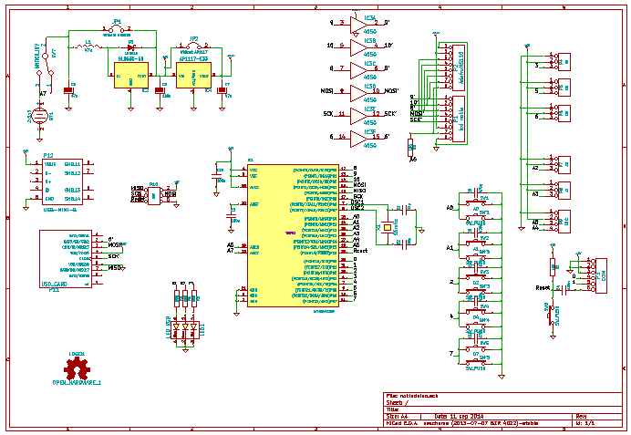
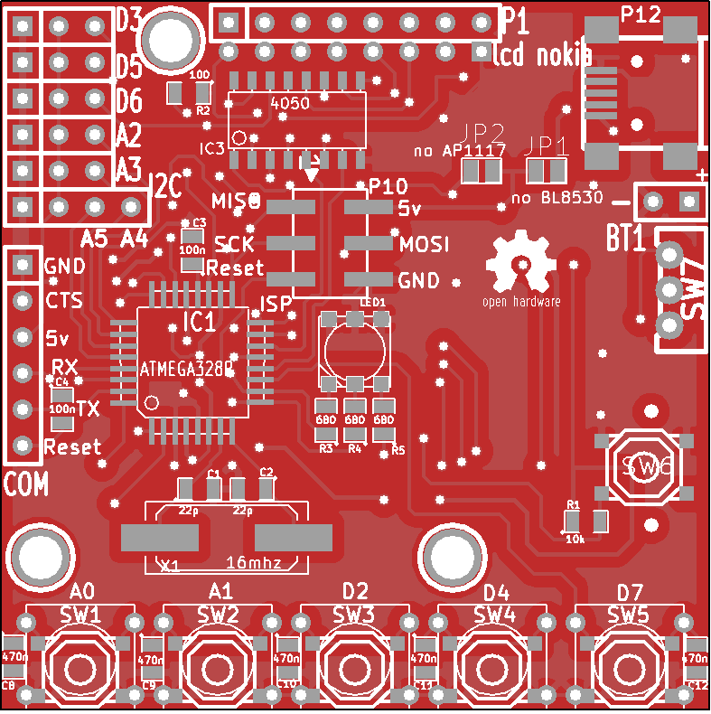
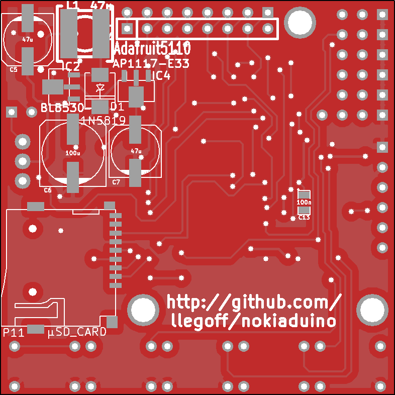

nokiaduino
==========
carte compatible Arduino équipée d'un afficheur de nokia 5110 , 
un clavier 5 touches, un lecteur de carte microSD, un convertisseur DC-DC boost
et des connecteur pour ajouter des capteurs.

*Arduino compatible board provided with a display of nokia 5110,
5 keys keyboard, a microSD card slot, a DC-DC boost converter
and connector to add sensors.*

Schemas
-------

PCB
---

